# 🏗️ Mechanical Engineer  
### 🚀 Portfolio | Research | Engineering  

## 📚 **Quick Links**

    
    
  

## 📄 **Download CV**
📌 [Download My CV](./CV_Sanjay_Dangi.pdf)

---

## 🏆 Areas of Interest

### 💡 Mechanical Design & Simulation
- Design and Analysis of Mechanical Systems  
- Computer-Aided Design (CAD), Computer-Aided Manufacturing (CAM)  
- Finite Element Method (FEM), Computational Fluid Dynamics (CFD)  

### 🔬 Experimental Techniques & Flow Diagnostics
- PIV Flow Visualization (Nd:YAG Laser & sCMOS Camera)  
- Vortex Flow Analysis and Electrohydrodynamic (EHD) Studies  

### 🌱 Sustainable Technologies
- Renewable Energy Systems  
- Organic Fertilizer Production via Anaerobic Digesters  

### ⚙️ Emerging Technologies & Manufacturing
- Battery and Fuel Cell Technologies  
- Additive Manufacturing (3D Printing)  
- Heat Transfer Systems  

### 🌬️ Environmental & Electrical Systems
- Air Quality Control (Electrostatic Precipitators - ESP)  
- High-Voltage Power Systems  

### 🧠 Research & Critical Thinking
- Research on EHD Vortex Flow & Particle Agglomeration at Northern Illinois University  
- Poster Presentation: Undergraduate Thesis on Agricultural Mechanization — Design, Analysis & Fabrication
- Podium Presentation: Master’s Thesis on Large-Scale EHD Vortex Flow Characterization  
- Strong analytical and scientific writing skills for data-driven conclusions

### 🛠️ Technical Skills & Tools
- Programmable Logic Controllers (PLCs)  
- Lathe & Drilling Machine Operations  
- MATLAB Programming  

### 🏭 Industrial Exposure
- Production Plant Management  
- Automotive Systems

---

## 🔥 **Latest Projects**
✅ **Air Quality Control:** Electrostatic Precipitator (ESP) for PM2.5 capture (filterless).  
✅ **EHD Vortex Flow Characterization Using PIV:** Large-Scale Electrohydrodynamic (EHD) Vortex for Particle Clustering in ESP.  
✅ **2D Laser Simulation:** Moving laser interaction with airflow and substrate.  
✅ **3D Printing Instructor:** Rockford Environmental Science Academy (RESA).  
✅ **Flow Imaging:** PIV analysis.

<table>
  <tr>
    <td>
      <figure>
         
        <figcaption> Components of Particle Image Velocimetry (PIV)</figcaption>
      </figure>
    </td>
    <td>
      <figure>
         
        <figcaption>Velocity Flow Field of EHD Vortex</figcaption>
      </figure>
    </td>
            <td>
      <figure>
         
               <figcaption>Tile Dispensing Mechanism</figcaption>
      </figure>
    </td>
  </tr>
</table>

<table>
  <tr>
    <td>
      <figure>
         
        <figcaption>3D Printer</figcaption>
      </figure>
    </td>
    <td>
      <figure>
         
               <figcaption>COMSOL 2D Simulation of Pulsating Laser on Alumina substrate(GIF)</figcaption>
      </figure>
    </td>
  </tr>
</table>

<table>
  <tr>
    <td>
      <figure>
        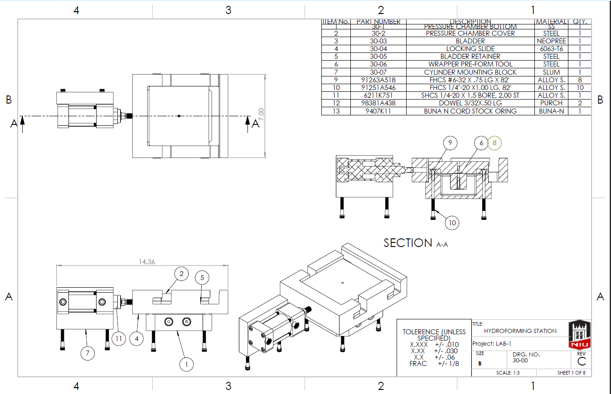 
        <figcaption>Hydroforming Machine - View 1</figcaption>
      </figure>
    </td>
    <td>
      <figure>
        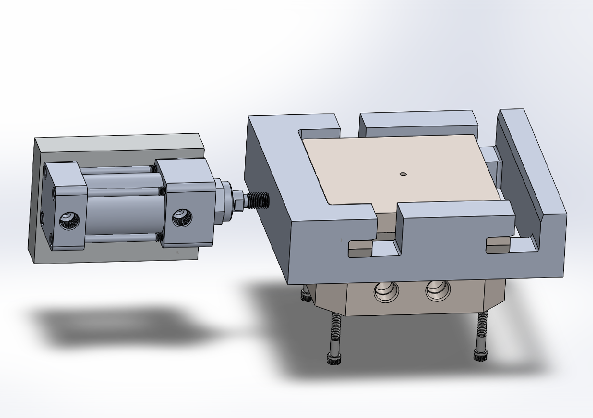 
        <figcaption>Hydroforming Machine - View 2</figcaption>
      </figure>
    </td>
  </tr>
</table>

<table>
  <tr>
    <td>
      <figure>
         
        <figcaption>Top View of FEM Mesh</figcaption>
      </figure>
    </td>
    <td>
      <figure>
        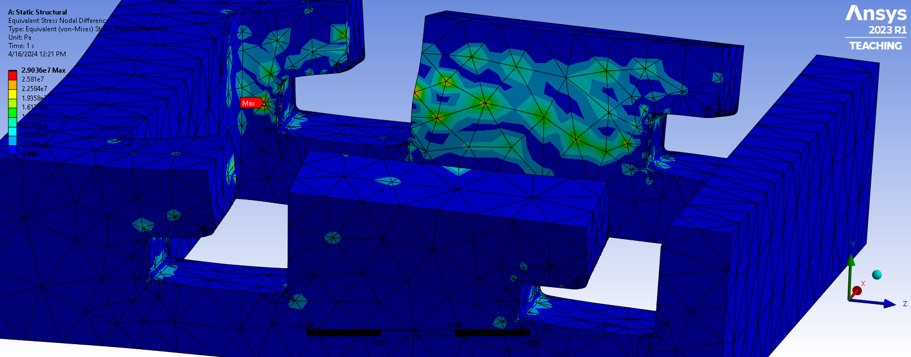 
        <figcaption>Zoomed Von Mises Stress Plot</figcaption>
      </figure>
    </td>
  </tr>
</table>

<table>
  <tr>
    <td>
      <figure>
         
        <figcaption>Side View of Model</figcaption>
      </figure>
    </td>
    <td>
      <figure>
         
        <figcaption>Wrapping Automation Setup</figcaption>
      </figure>
    </td>
  </tr>
</table>

<table>
  <tr>
    <td>
      <figure>
        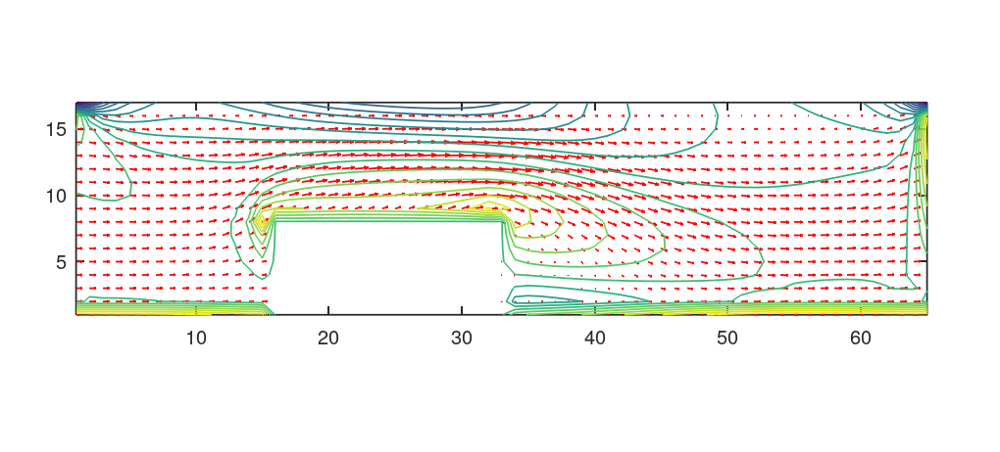 
        <figcaption>Simulation of Fluid Flow Due to Obastacle (Python) </figcaption>
      </figure>
    </td>
    <td>
      <figure>
        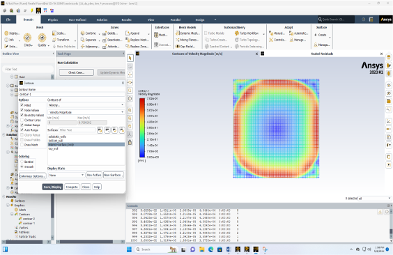 
        <figcaption>Heat Driven Cavity Flow (ANSYS Fluent)</figcaption>
      </figure>
    </td>
  </tr>
</table>

</body>
</html>

<table>
  <tr>
    <td>
      <figure>
         
        <figcaption> Surface Temperature </figcaption>
      </figure>
    </td>
    <td>
      <figure>
         
        <figcaption>Velocity Field and Temperature Profile</figcaption>
      </figure>
    </td>
        <td>
      <figure>
         
        <figcaption> Temperature at h1(W/(m²·K)) </figcaption>
      </figure>
    </td>
  </tr>
</table>

---

## 🎓 **Education**
- **M.S. Mechanical Engineering**, Northern Illinois University, USA *(2023–Present)* — GPA: **3.91**  
  - Thesis: *PIV Characterization of a Large-Scale EHD Vortex Confinement Flow in Wire-to-Plate ESP for Particle Agglomeration.*

- **B.E. Mechanical Engineering**, Pulchowk Campus, Tribhuvan University, Nepal *(2014–2018)* — 74%  
  - Thesis: *Design and Fabrication of Manually Operated Engine-Powered Rice Reaper.*

<table>
  <tr>
    <td>
      <figure>
       
          <figcaption>3D SolidWorks Model of Rice Reaper</figcaption>
     </figure>
    </td>
    <td>
      <figure>
       
        <figcaption>Fabricated Rice Reaper</figcaption>
     </figure>
    </td>
  </tr>
</table>

---

## 🔬 **Research Interests**
- PIV Flow Visualization.  
- CFD and FEM Simulation (COMSOL, ANSYS).  
- Solid Modeling (SolidWorks, AutoCAD).  
- Air Quality Control (Electrostatic Precipitators).  
- Renewable Energy Systems (Biogas, Batteries, Fuel Cells).  
- Additive Manufacturing (3D Printing).

<table>
  <tr>
    <td>
     <figure>
     
    <figcaption>Industrial Scale ESP</figcaption>
     </figure>
    </td>
    <td>
     <figure>
    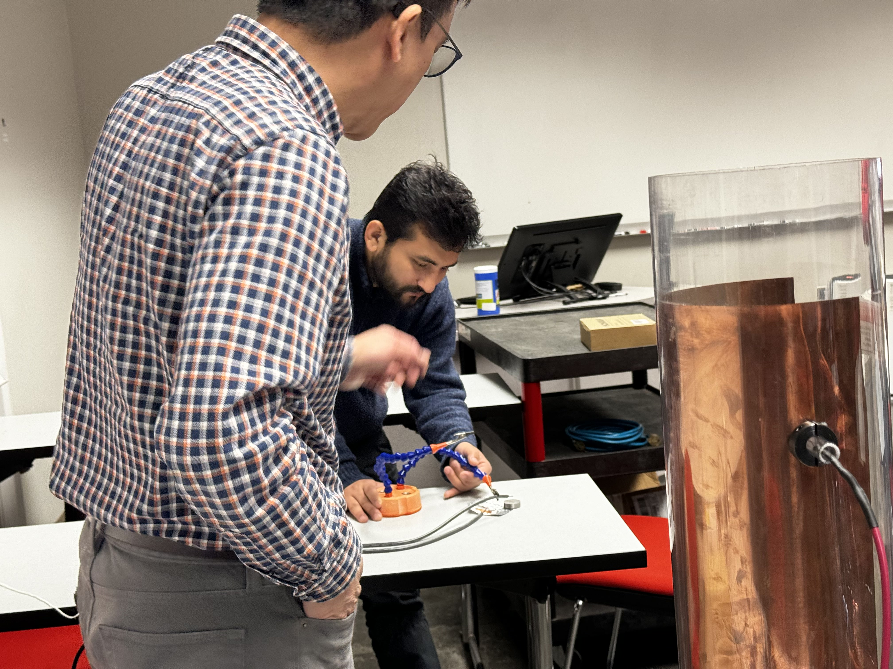 
    <figcaption>STEM demonstration of simplified ionization and air cleaning setup</figcaption>
     </figure>
    </td>
    
  </tr>
</table>

---

## 📚 **Publications**
- **Sanjay Dangi** and **E.M. Lee**, *"PIV Characterization of a Large-Scale EHD Vortex Confinement Flow in Wire-to-Plate ESP for Particle Agglomeration,"* American Association for Aerosol Research (AAAR), 2024.  
- **S. Dangi** et al., *"Design and Fabrication of Engine Powered Manually Operated Rice Reaper,"* Research Center for Applied Science and Technology (RECAST), 2018.

<table>
  <tr>
    <td>
      <figure>
    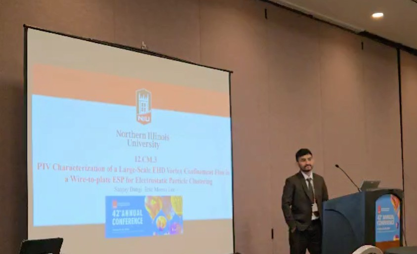 
    <figcaption>Me Presenting at AAAR Conference (2024)</figcaption>    
    </figure>
    </td>
    </td>
  </tr>
</table>

---

## 🛠 **In Progress**
- **Thesis + Research Paper:**  
  *"PIV Characterization of Large-Scale EHD Vortex Flow in Wire-to-Plate ESP for Particle Agglomeration."*

<table>
  <tr>
    <td>
      <figure>
      </figure> 
      <figcaption>Labrotary Setup for Vortex Generator</figcaption>
    </figure>
    </td>
  </tr>
</table>

---

## 🏢 **Experiences**
 
### 🧪 **Graduate Research Assistant**, Northern Illinois University *(Aug 2023 – Dec 2025)*  
- 🌪️ Conducted research on **electrohydrodynamic (EHD) flows** to generate large-scale vortices for sub-micron particle confinement and agglomeration via **non-thermal plasma (NTP)** effects.  
- 🛠️ Designed and fabricated an **ESP-integrated vortex generator** using **SolidWorks** and precision machining to study flow dynamics in electrically energized channels.  
- 📸 Applied **2D–2C Particle Image Velocimetry (PIV)** to visualize vortex flow fields seeded with **1 µm DEHS tracer particles**, illuminated by a **1 mm Nd:YAG laser sheet**.  
- 🧪 Developed experimental protocols for **ESP operation**, **PIV/PTV measurements**, and controlled particle sampling using **PM sensors** to quantify particle agglomeration with high measurement accuracy.  
- 📊 Extracted **velocity and vorticity fields** using **PIVview** and performed **MATLAB-based quantification** of complex datasets for hypothesis testing and validation.  
- 🔬 Demonstrated and quantified **sub-micron particle entrapment and agglomeration** induced by large-scale EHD vortices through real-time data acquisition and analysis.  
- 🎤 Delivered a **podium presentation** of preliminary findings at the **42nd AAAR Annual Conference**, Albuquerque, NM, highlighting advances in EHD-driven particle agglomeration.

 <table>
  <tr>
    <td>
      <figure>
      </figure> 
      <figcaption>3D CAD Model for Vortex Generator Integrated with   ESP and Optimized for PIV Setup Compatibility</figcaption>
    </figure>
    </td>
  </tr>
</table>

### 👨‍🏫 **Teaching Assistant**, Mechanical Engineering, Northern Illinois University *(Aug 2025 – Dec 2025)*  
- 📐 Assisted in teaching **Engineering Graphics (MEE-270)**, providing hands-on instruction in CAD, engineering drawing standards, and product development through mentored **SolidWorks** laboratory sessions.  
- 🌊 Supported instruction in **Fluid Mechanics (MEE-340)** by reinforcing core concepts such as dimensional analysis, conservation of mass, momentum, and energy, and internal and external flow applications.  
- 🧮 Guided students in numerical problem formulation, physical interpretation of governing equations, and application of fluid mechanics principles to real engineering systems.  
- 🗣️ Enhanced student engagement through clear technical communication and detail-oriented practical demonstrations.  
- 📋 Coordinated course evaluations and supported accreditation-related activities to maintain academic standards and improve learning outcomes.

### 👨‍🏫 **Project Assistant**, Rockford Environmental Science Academy (RESA)  *(Jan 2024 – Dec 2024)* 
- 🖨️ Taught **3D printing** and **Tinkercad** workshops.  
- 🧠 Developed hands-on challenges for students.

### ⚙️ **Mechanical Engineer / Plant In-Charge**, Khilung Kalika Biogas Power Plant, Nepal *(Aug 2019 – Feb 2022)*  
- 🧪 Maintenance of **Anaerobic Digester** and **Decantation Unit**.  
- 💻 Basic programming and maintenance of **PLC (ABB)** and **SCADA** systems.  
- 💨 Supervision of **Chemical Scrubbing Unit** for biogas purification.  
- 🔋 Operation and maintenance of **Biogas (1 MW)** and **Diesel Generators (700 kW)**, including **Biogas-Powered Boiler Unit** handling.  
- 🌱 Supervised production of **Granular and Liquid Organic Fertilizer**.  
- 🏭 Responsible for **Factory Line Maintenance**, **Inspection**, and **Inventory Management**.  
- 👷‍♂️ Led **Technicians Team** and managed **labor operations**.

  <table>
  <tr>
    <td>
      <figure>
         
        <figcaption>Gas Production Process Flow (SCADA Interface)</figcaption>
      </figure>
    </td>
    <td>
      <figure>
         
               <figcaption>Biogas Purification and Power Generation (SCADA)</figcaption>
      </figure>
    </td>
  </tr>
</table>

### 💧 **Wastewater Treatment Project Lead**, Nepal *(2019 – 2021)*  
- 🏗️ Led the **installation and testing** of a wastewater treatment plant in collaboration with **Bikon Water Treatment Pvt. Ltd.**  
- ⚗️ Oversaw **chemical treatment** of wastewater from the **decantation process**.  
- 📊 Conducted **lab analysis** on water quality before and after treatment to evaluate effectiveness.

### 👨‍🔧 **Internship Experiences**

#### 🚗 **TOYOTA (UTS), Nepal** *(Jan 2018 – Apr 2018)*  
- 🔧 Assisted in **general servicing and preventive maintenance** of **Internal Combustion (IC) engines** across multiple vehicle platforms.  
- ⚡ Supported **fault inspection and diagnostics** for **Electric Vehicles (EVs)** and **Battery Systems**.  
- ♻️ Gained exposure to **LEAN Manufacturing Concepts**, including waste minimization and process optimization.

#### 🏭 **Chaudhary Groups, Kathmandu, Nepal** *(May 2018 – Aug 2018)*  
- 🏗️ Participated in the **re-design and optimization** of **plant layouts** to improve production efficiency.  
- 🛠️ Supported **maintenance and troubleshooting** of **noodle** and **cheeseball** production lines, including associated **boiler** and **diesel generator systems**.  
- 🧰 Assisted in **factory line inspection** and **routine equipment health monitoring**.

 <table>
  <tr>
    <td>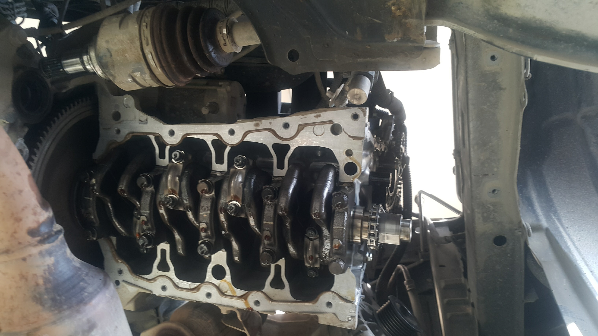</td>
    <td></td>
  </tr>
</table>
---

## 💻 **Skills**
- **Programming:** MATLAB, Python (Machine Learning), PLC (ABB), Siemens STEP-7, SCADA Systems.  
- **Software:** SolidWorks, AutoCAD, COMSOL, ANSYS, Git, GitHub, LaTeX, Overleaf, Jupyter Notebook.  
- **Machines & Tools:** Arduino, Lathe, Drill, Water Jet Cutter, 3D Printer, Laser Engraver, Welding.

---

## 🏆 **Honors & Awards**
- 🥇 Undergraduate Research Grant, **RECAST, Nepal**.

---
## 🏆 **Certifications**
- 🥇 Machine Learning
<table>
  <tr>
    <td>
      <figure>
        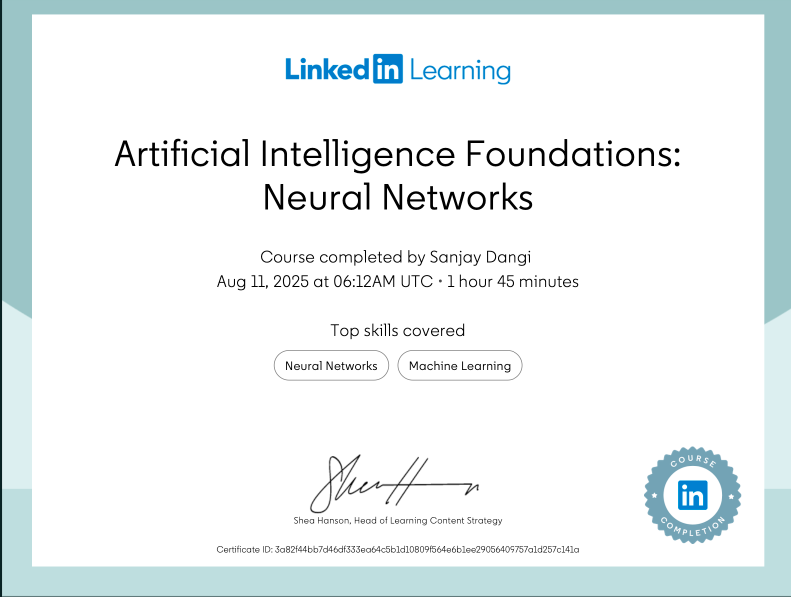 
        <figcaption> Artificial Intelligence Foundations: Neural Network </figcaption>
      </figure>
    </td>
    <td>
      <figure>
        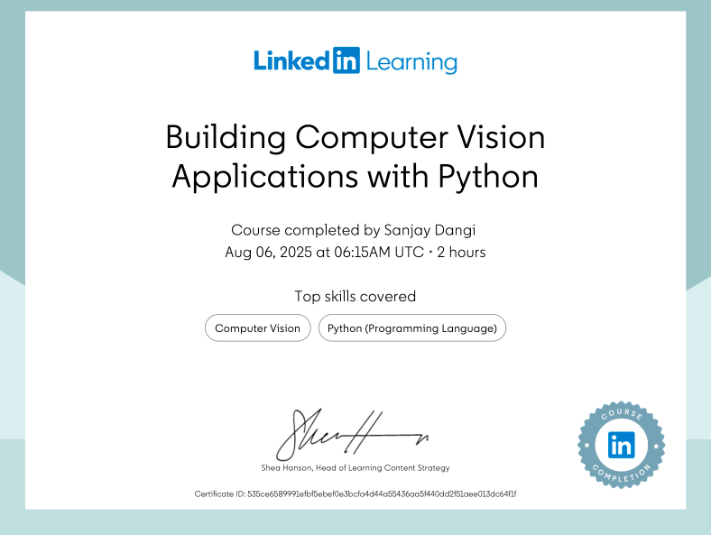 
        <figcaption>Building Computer Vision Application with Python</figcaption>
      </figure>
    </td>
        <td>
      <figure>
        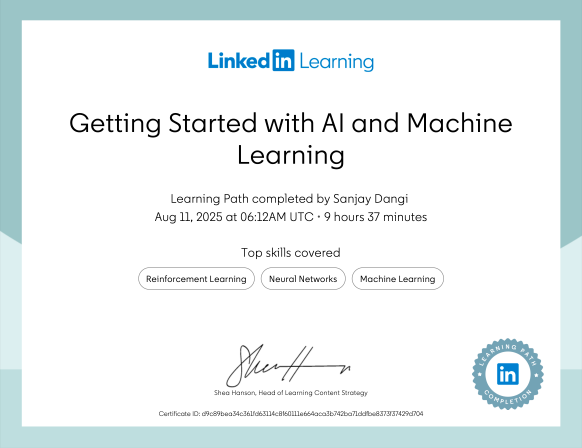 
        <figcaption> Getting Started with AI and Machine Learning </figcaption>
      </figure>
    </td>
 </tr>
</table>
   <table>
  <tr> 
     <td>
      <figure>
         
        <figcaption> Hands-On Pytorch Machine Learning </figcaption>
      </figure>
    </td>
    <td>
      <figure>
        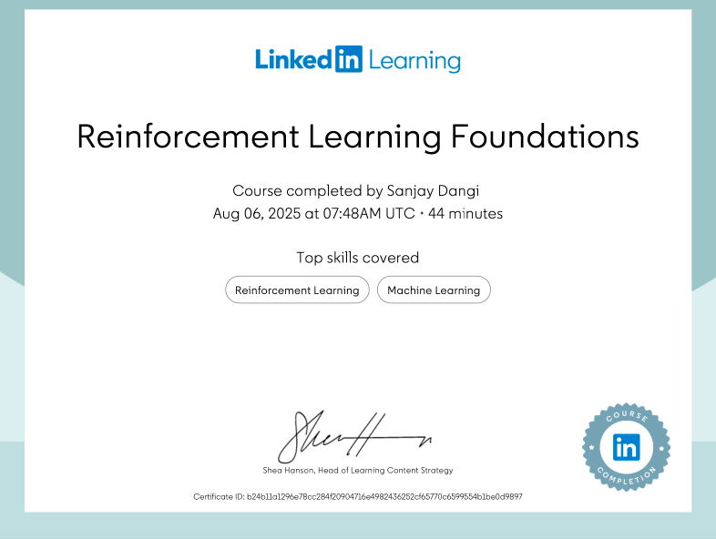 
        <figcaption>Reinforcement Learning Foundations</figcaption>
      </figure>
    </td>
        <td>
      <figure>
        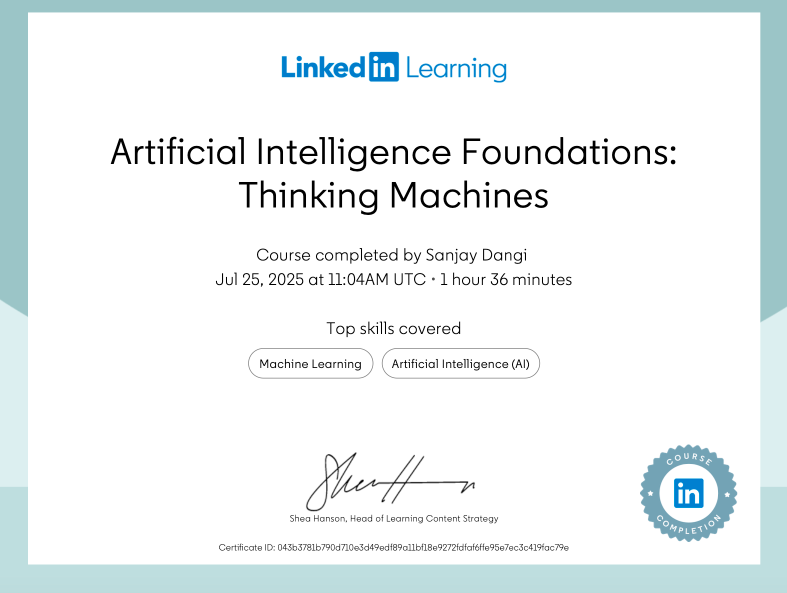 
        <figcaption> Artificial Intelligence Foundations: Thinking Machines </figcaption>
      </figure>
    </td>
 </tr>
</table>
   <table>
  <tr> 
     <td>
      <figure>
        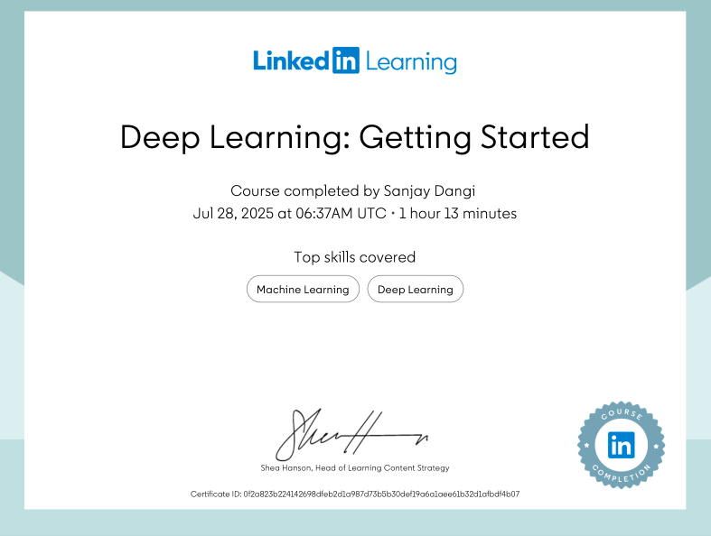 
        <figcaption> Deep Learning: Getting Started </figcaption>
      </figure>
    </td>
    <td>
      <figure>
        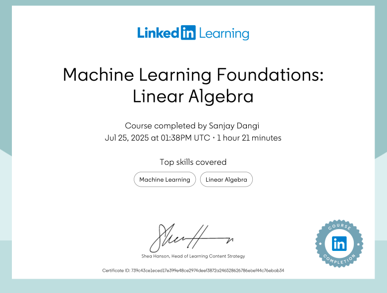 
        <figcaption>Machine Learning Foundations: Linear Algebra</figcaption>
      </figure>
    </td>
  </tr>
</table>

---
## 🚀 **Currently Learning**
- 🤖 Machine Learning (Neural Networks)  
- 🔧 Advanced PLC Programming  
- 💨 CFD Modeling (COMSOL/ANSYS)  
- 🛠️ SolidWorks (CSWA/P Certification)

---

# ⭐ **Connect With Me**
📩 **Email:** dcsanjay77@email.com  
💼 **LinkedIn:** [LinkedIn Profile](https://www.linkedin.com/in/sanjay-dangi-01a0b5147/)
