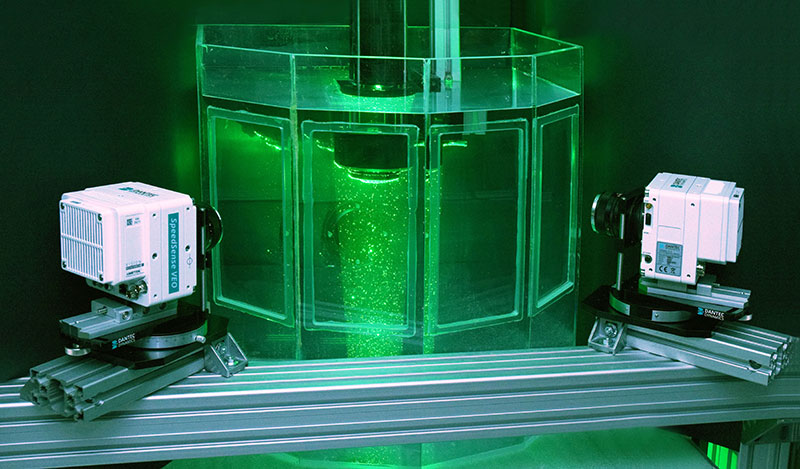
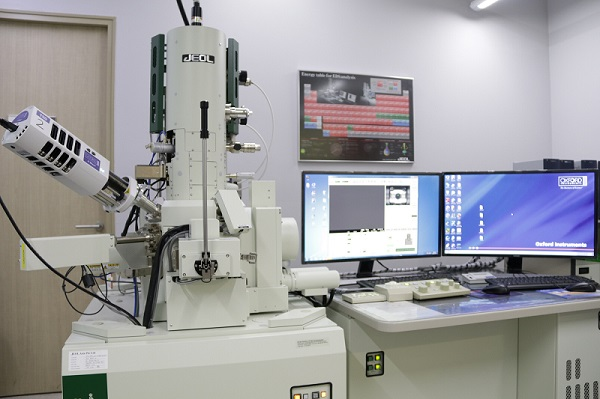
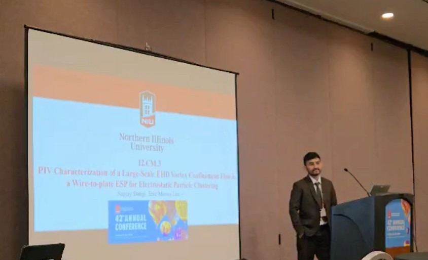
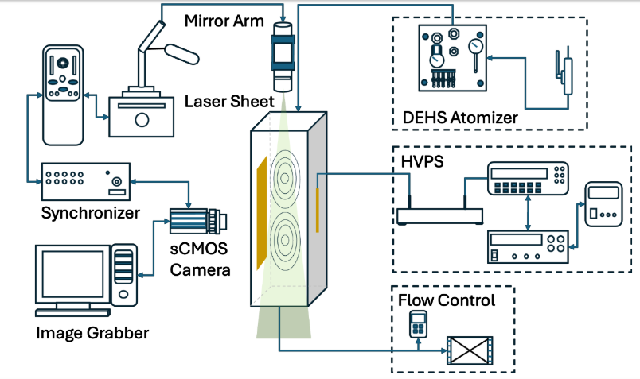

# 🏗️ Mechanical Engineer  
### 🚀 Portfolio | Research | Engineering  

## 🏆 Areas of Interest:
Design and Analysis of Mechanical Systems | CAD-CAM | FEM | CFD  
PIV Flow Visualization (Nd:YAG Laser + sCMOS Camera)|Vortex Flow Analysis   
Renewable Energy | Battery & Fuel Cell | Additive Manufacturing (3D Printing) | Heat Transfer  
Air Quality Control (ESP) | High-Voltage Systems  
PLCs | Lathe/Drill Operation | Programming  

---

## 📚 **Quick Links**

---

## 📄 **Download CV**
📌 [Download My CV](./CV_NOT.pdf)

---

## 🔥 **Latest Projects**
✅ **Air Quality Control:** Electrostatic Precipitator (ESP) for PM2.5 capture (filterless).  
✅ **PIV Flow Characterization:** Large-Scale EHD Vortex for Particle Clustering in ESP.  
✅ **2D Laser Simulation:** Moving laser interaction with airflow and substrate.  
✅ **3D Printing Instructor:** Rockford Environmental Science Academy (RESA).  
✅ **Microscopy & Flow Imaging:** SEM and PIV analysis.  

  
  
  
  

---

## 🎓 **Education**
- **M.S. Mechanical Engineering**, Northern Illinois University, USA *(2023–Present)* — GPA: **3.91**  
  - Thesis: *PIV Characterization of a Large-Scale EHD Vortex Confinement Flow in Wire-to-Plate ESP for Particle Agglomeration*

- **B.E. Mechanical Engineering**, Pulchowk Campus, Tribhuvan University, Nepal *(2014–2018)* — 74%  
  - Project: *Design and Fabrication of Manually Operated Engine-Powered Rice Reaper*

  
  

---

## 🔬 **Research Interests**
- PIV Flow Visualization
- CFD and FEM Simulation (COMSOL, ANSYS)
- Solid Modeling (SolidWorks, AutoCAD)
- Air Quality Control (Electrostatic Precipitators)
- Renewable Energy Systems (Biogas, Batteries, Fuel Cells)
- Additive Manufacturing (3D Printing)

  

---

## 📚 **Publications**
- **Sanjay Dangi** and **E.M. Lee**, *"PIV Characterization of a Large-Scale EHD Vortex Confinement Flow in Wire-to-Plate ESP for Particle Agglomeration,"* American Association for Aerosol Research (AAAR), 2024.
- **S. Dangi** et al., *"Design and Fabrication of Engine Powered Manually Operated Rice Reaper,"* Research Center for Applied Science and Technology (RECAST), 2018.

  

---

## 🛠 **In Progress**
- **Thesis + Research Paper:**  
  *"PIV Characterization of Large-Scale EHD Vortex Flow in Wire-to-Plate ESP for Particle Clustering"*

  

---

## 🏢 **Experience**

### **Research Assistant**, Northern Illinois University, IL *(Aug 2023 – May 2024)*  
- Designed lab-scale **EHD vortex generator** (ESP-based).  
- PIV Image Processing (PIVview, PIVlab) + MATLAB Data Analysis.
- Thesis Research on Large-Scale EHD Vortex for Particle Agglomeration.

### **Project Instructor**, Rockford Environmental Science Academy (RESA)  
- Taught **3D printing** and **Tinkercad** workshops.  
- Developed hands-on challenges for students.

### **Plant Incharge**, Khilung Kalika Biogas Plant, Nepal *(Aug 2024 – Present)*  
- Managed **anaerobic digestion systems**, diesel generators, biogas scrubbing.  
- **PLC and SCADA Operations**.

### **Internships:**  
- **TOYOTA (UTS), Nepal** *(Maintenance, Servicing, Lean Training)*  
- **Chaudhary Food Pvt. Ltd., Nepal** *(Factory Time Study, CAD Updates)*

---

## 💻 **Skills**
- **Programming:** MATLAB, Python (Machine Learning), PLC (ABB), SCADA Systems.  
- **Software:** SolidWorks, AutoCAD, COMSOL, ANSYS, Git, GitHub, LaTeX, Overleaf, Jupyter Notebook, PyCharm, Anaconda.  
- **Machines & Tools:** Lathe, Drill, Water Jet Cutter, 3D Printer, Laser Engraver, Welding.  

---

## 🏆 **Honors & Awards**
- Undergraduate Research Grant, **RECAST, Nepal**.

---

## 🚀 **Currently Learning**
- **Machine Learning (Neural Networks)**
- **Advanced PLC Programming**
- **CFD Modeling (COMSOL/ANSYS)**
- **SolidWorks (CSWA/P Certification)**

---

# ⭐ **Connect With Me**
📩 **Email:** yourname@email.com  
💼 **LinkedIn:** [LinkedIn Profile](#)  
📁 **Portfolio:** [Your Website (if any)](#)  

---

# 🎯 **How To Use This**
📌 Download this file as `README.md` and upload it to **your GitHub repository**!  
🎯 This will be the **homepage of your GitHub profile**, making it look professional!

---

✅ **This version is 100% optimized for GitHub**  
✅ **Looks professional, structured, and easy to read**  
✅ **Now ready for employers, professors, or collaborators to see your work!**

Would you like help adding **GitHub stats and badges** for extra customization? 🚀😃
