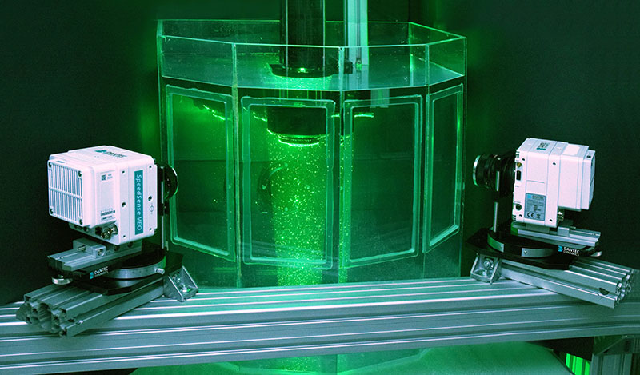
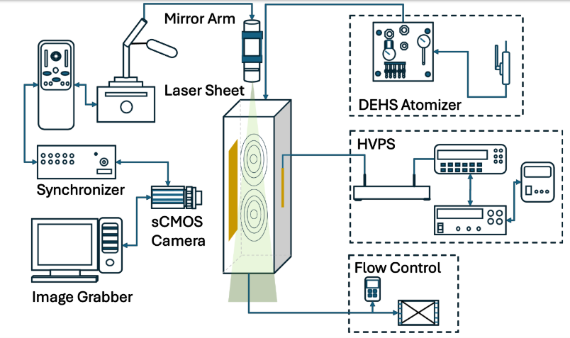
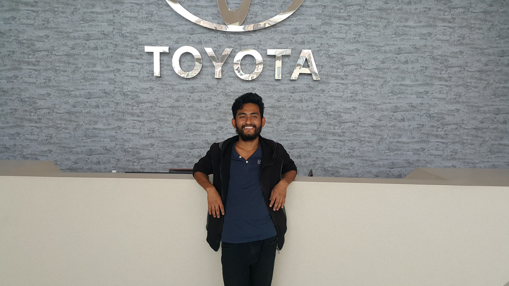

# 🏗️ Mechanical Engineer  
### 🚀 Portfolio | Research | Engineering  

## 🏆 Areas of Interest

## 🏆 Areas of Interest

### 💡 Mechanical Design & Simulation
- Design and Analysis of Mechanical Systems  
- Computer-Aided Design (CAD), Computer-Aided Manufacturing (CAM)  
- Finite Element Method (FEM), Computational Fluid Dynamics (CFD)  

### 🔬 Experimental Techniques & Flow Diagnostics
- PIV Flow Visualization (Nd:YAG Laser & sCMOS Camera)  
- Vortex Flow Analysis and Electrohydrodynamic (EHD) Studies  

### 🌱 Sustainable Technologies
- Renewable Energy Systems  
- Organic Fertilizer Production via Anaerobic Digesters  

### ⚙️ Emerging Technologies & Manufacturing
- Battery and Fuel Cell Technologies  
- Additive Manufacturing (3D Printing)  
- Heat Transfer Systems  

### 🌬️ Environmental & Electrical Systems
- Air Quality Control (Electrostatic Precipitators - ESP)  
- High-Voltage Power Systems  

### 🧠 Research & Critical Thinking
- Research on EHD Vortex Flow & Particle Agglomeration at Northern Illinois University  
- Poster Presentation: Undergraduate Thesis on Agricultural Mechanization — Design, Analysis & Fabrication
- Podium Presentation: Master’s Thesis on Large-Scale EHD Vortex Flow Characterization  
- Strong analytical and scientific writing skills for data-driven conclusions

### 🛠️ Technical Skills & Tools
- Programmable Logic Controllers (PLCs)  
- Lathe & Drilling Machine Operations  
- MATLAB Programming  

### 🏭 Industrial Exposure
- Production Plant Management  
- Automotive Systems

---

## 📚 **Quick Links**

    
    
  

## 📄 **Download CV**
📌 [Download My CV](./CV_NOT.pdf)

---

## 🔥 **Latest Projects**
✅ **Air Quality Control:** Electrostatic Precipitator (ESP) for PM2.5 capture (filterless).  
✅ **PIV Flow Characterization:** Large-Scale Electrohydrodynamic (EHD) Vortex for Particle Clustering in ESP.  
✅ **2D Laser Simulation:** Moving laser interaction with airflow and substrate.  
✅ **3D Printing Instructor:** Rockford Environmental Science Academy (RESA).  
✅ **Flow Imaging:** PIV analysis.

<table>
  <tr>
    <td></td>
     <td></td>
   "390"></td>
  </tr>
</table>
<table>
  <tr>
    <td></td>
    <td>
</table>

<table>
  <tr>
    <td></td>
  </tr>
</table>
---

## 🎓 **Education**
- **M.S. Mechanical Engineering**, Northern Illinois University, USA *(2023–Present)* — GPA: **3.91**  
  - Thesis: *PIV Characterization of a Large-Scale EHD Vortex Confinement Flow in Wire-to-Plate ESP for Particle Agglomeration.*

- **B.E. Mechanical Engineering**, Pulchowk Campus, Tribhuvan University, Nepal *(2014–2018)* — 74%  
  - Thesis: *Design and Fabrication of Manually Operated Engine-Powered Rice Reaper.*

<table>
  <tr>
    <td></td>
    <td></td>
  </tr>
</table>

---

## 🔬 **Research Interests**
- PIV Flow Visualization.  
- CFD and FEM Simulation (COMSOL, ANSYS).  
- Solid Modeling (SolidWorks, AutoCAD).  
- Air Quality Control (Electrostatic Precipitators).  
- Renewable Energy Systems (Biogas, Batteries, Fuel Cells).  
- Additive Manufacturing (3D Printing).

<table>
  <tr>
    <td></td>
  </tr>
</table>

---

## 📚 **Publications**
- **Sanjay Dangi** and **E.M. Lee**, *"PIV Characterization of a Large-Scale EHD Vortex Confinement Flow in Wire-to-Plate ESP for Particle Agglomeration,"* American Association for Aerosol Research (AAAR), 2024.  
- **S. Dangi** et al., *"Design and Fabrication of Engine Powered Manually Operated Rice Reaper,"* Research Center for Applied Science and Technology (RECAST), 2018.

<table>
  <tr>
    <td></td>
  </tr>
</table>

---

## 🛠 **In Progress**
- **Thesis + Research Paper:**  
  *"PIV Characterization of Large-Scale EHD Vortex Flow in Wire-to-Plate ESP for Particle Agglomeration."*

<table>
  <tr>
    <td></td>
  </tr>
</table>

---

## 🏢 **Experience**

### 🧪 **Research Assistant**, Northern Illinois University, IL *(Aug 2023 – May 2024)*  
- 🔬 Designed lab-scale **EHD vortex generator** (ESP-based).  
- 📸 PIV Image Processing (PIVview, PIVlab) + MATLAB Data Analysis.  
- 📘 Thesis Research on Large-Scale EHD Vortex for Particle Agglomeration.

### 👨‍🏫 **Project Instructor**, Rockford Environmental Science Academy (RESA)  
- 🖨️ Taught **3D printing** and **Tinkercad** workshops.  
- 🧠 Developed hands-on challenges for students.

### ⚙️ **Mechanical Engineer / Plant In-Charge**, Khilung Kalika Biogas Power Plant, Nepal *(Aug 2019 – Feb 2022)*  
- 🧪 Maintenance of **Anaerobic Digester** and **Decantation Unit**.  
- 💻 Basic programming and maintenance of **PLC (ABB)** and **SCADA** systems.  
- 💨 Supervision of **Chemical Scrubbing Unit** for biogas purification.  
- 🔋 Operation and maintenance of **Biogas (1 MW)** and **Diesel Generators (700 kW)**, including **Biogas-Powered Boiler Unit** handling.  
- 🌱 Supervised production of **Granular and Liquid Organic Fertilizer**.  
- 🏭 Responsible for **Factory Line Maintenance**, **Inspection**, and **Inventory Management**.  
- 👷‍♂️ Led **Technicians Team** and managed **labor operations**.

### 💧 **Wastewater Treatment Project Lead**, Nepal *(2019 – 2021)*  
- 🏗️ Led the **installation and testing** of a wastewater treatment plant in collaboration with **Bikon Water Treatment Pvt. Ltd.**  
- ⚗️ Oversaw **chemical treatment** of wastewater from the **decantation process**.  
- 📊 Conducted **lab analysis** on water quality before and after treatment to evaluate effectiveness.

### 👨‍🔧 **Internship Experiences**

#### 🚗 **TOYOTA (UTS), Nepal** *(Jan 2018 – Apr 2018)*  
- 🔧 Assisted in **general servicing and preventive maintenance** of **Internal Combustion (IC) engines** across multiple vehicle platforms.  
- ⚡ Supported **fault inspection and diagnostics** for **Electric Vehicles (EVs)** and **Battery Systems**.  
- ♻️ Gained exposure to **LEAN Manufacturing Concepts**, including waste minimization and process optimization.
- <table>
  <tr>
    <td></td>
    <td></td>
  </tr>
</table>

#### 🏭 **Chaudhary Groups, Kathmandu, Nepal** *(May 2018 – Aug 2018)*  
- 🏗️ Participated in the **re-design and optimization** of **plant layouts** to improve production efficiency.  
- 🛠️ Supported **maintenance and troubleshooting** of **noodle** and **cheeseball** production lines, including associated **boiler** and **diesel generator systems**.  
- 🧰 Assisted in **factory line inspection** and **routine equipment health monitoring**.

---

## 💻 **Skills**
- **Programming:** MATLAB, Python (Machine Learning), PLC (ABB), SCADA Systems.  
- **Software:** SolidWorks, AutoCAD, COMSOL, ANSYS, Git, GitHub, LaTeX, Overleaf, Jupyter Notebook.  
- **Machines & Tools:** Arduino, Lathe, Drill, Water Jet Cutter, 3D Printer, Laser Engraver, Welding.

---

## 🏆 **Honors & Awards**
- 🥇 Undergraduate Research Grant, **RECAST, Nepal**.

---

## 🚀 **Currently Learning**
- 🤖 Machine Learning (Neural Networks)  
- 🔧 Advanced PLC Programming  
- 💨 CFD Modeling (COMSOL/ANSYS)  
- 🛠️ SolidWorks (CSWA/P Certification)

---

# ⭐ **Connect With Me**
📩 **Email:** dcsanjay77@email.com  
💼 **LinkedIn:** [LinkedIn Profile](https://www.linkedin.com/in/sanjay-dangi-01a0b5147/)
